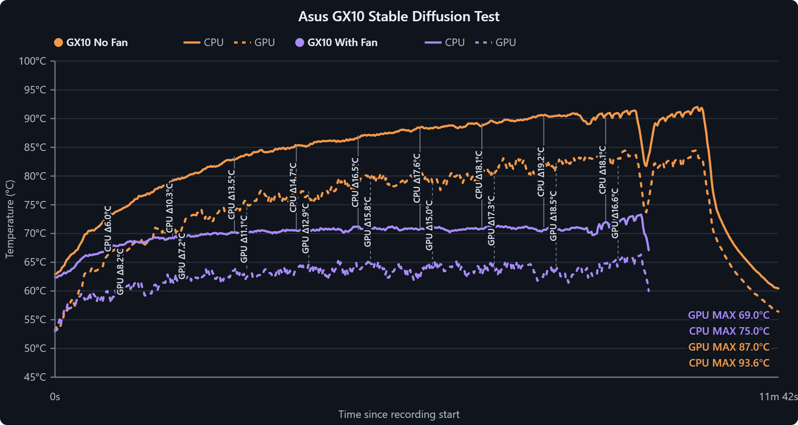
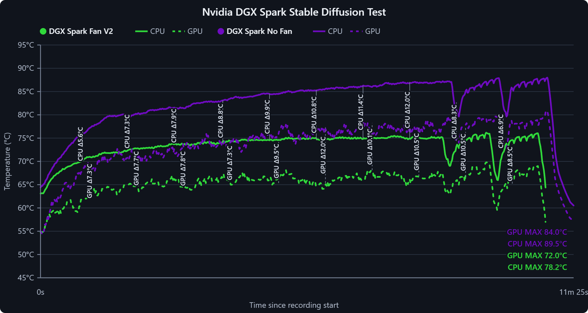

# DGX-Spark-Fan-Shroud

Fan shrouds for NVIDIA GB10 systems, including the NVIDIA DGX Spark and partner platforms, for improved cooling performance on long workloads. Full STL/STEP files, electronics schematics, RP2040 firmware, and the FanController host application provide automatic temperature-based fan control.

The stock cooling on the DGX Spark can thermal-throttle during sustained multi-hour training or inference runs. This project adds a 3D-printed shroud that mounts a high-static-pressure Noctua industrialPPC fan over the heatsink, driven by a closed-loop controller that ramps fan speed with chip temperature — quiet at idle, full airflow under load.

## Cooling Results

### ASUS Ascent GX10



In this roughly 12-minute Stable Diffusion run, the shroud reduced the recorded CPU peak from 93.6 °C to 75.0 °C and the GPU peak from 87.0 °C to 69.0 °C — reductions of 18.6 °C and 18.0 °C, respectively.

### NVIDIA DGX Spark



In this roughly 11-minute Stable Diffusion run, the V2 shroud reduced the recorded CPU peak from 89.5 °C to 78.2 °C and the GPU peak from 84.0 °C to 72.0 °C — reductions of 11.3 °C and 12.0 °C, respectively.

### Findings

The benchmark comparisons show lower CPU and GPU peak temperatures with the fan shroud installed. The ASUS Ascent GX10 result rounds to an approximately 20 °C reduction, while the NVIDIA DGX Spark V2 result and the other platform-specific models are approximately 10 °C reductions. Actual results vary with workload, ambient temperature, print fit, fan, and system vent layout.

| System | CPU peak reduction | GPU peak reduction | Approximate temperature drop |
| --- | ---: | ---: | ---: |
| ASUS Ascent GX10 | 18.6 °C measured | 18.0 °C measured | ~20 °C |
| NVIDIA DGX Spark | 11.3 °C measured | 12.0 °C measured | ~10 °C |
| Gigabyte AI TOP ATOM | ~10 °C | ~10 °C | ~10 °C |
| HP ZGX Nano | ~10 °C | ~10 °C | ~10 °C |
| Lenovo ThinkStation PGX | ~10 °C | ~10 °C | ~10 °C |
| MSI EdgeXpert | ~10 °C | ~10 °C | ~10 °C |

- **Approximately 20 °C lower peak temperatures** on the ASUS Ascent GX10.
- **Approximately 10 °C lower peak temperatures** on the other supported systems.
- Configured to **maintain ~80 °C under normal regular use** via the software fan curve.
- See `Benchmark/` for the interactive thermal benchmark graph and source comparisons.

## Compatibility

> **Compatibility note:** The design has been tested on the **ASUS Ascent GX10** and **NVIDIA DGX Spark**. In the charted tests, the NVIDIA DGX Spark reduction is about half the ASUS result because of its vent layout.
>
> Platform-specific files are also included for the **Gigabyte AI TOP ATOM**, **HP ZGX Nano**, **Lenovo ThinkStation PGX**, and **MSI EdgeXpert**. These variants have different chassis dimensions or vent layouts; verify fit and clearance before printing. Editable STEP files are included for inspection and adaptation.

## Repository Contents

| Path | Description |
| --- | --- |
| `3D Files/Asus Ascent GX10/` | ASUS shroud V2 plus shroud and stacking legs, in print-ready STL and editable STEP formats |
| `3D Files/Gigabyte AI Top Atom/` | Gigabyte fan/front shrouds plus shroud and stacking legs, in STL and STEP formats |
| `3D Files/HP ZGX Nano/` | HP fan/front shrouds plus shroud and stacking legs, in STL and STEP formats |
| `3D Files/Lenovo Thinkstation PGX/` | Lenovo fan/front shrouds plus shroud and stacking legs, in STL and STEP formats |
| `3D Files/MSI EdgeXpert/` | MSI fan/front shrouds plus shroud and stacking legs, in STL and STEP formats |
| `3D Files/Nvidia DGX Spark/` | NVIDIA fan/front shrouds plus shroud and stacking legs, in STL and STEP formats |
| `Benchmark/` | Interactive thermal benchmark graph plus PNG comparisons for quick viewing on GitHub |
| `firmware/` | MicroPython firmware for the RP2040-Zero and X9C103 digital potentiometer |
| `software/` | FanController host application, systemd service, and tests |

## Bill of Materials

| Part | Purpose | Link |
| --- | --- | --- |
| Noctua industrialPPC fan | High static pressure / airflow through the shroud | https://amzn.to/4gRzM0Q |
| PWM controller | Generates the 25 kHz PWM signal that drives the fan | https://amzn.to/4pzXktr |
| Digital potentiometer | Sets the control voltage on the PWM controller from the microcontroller | https://amzn.to/4ffs8ft |
| RP2040-Zero | Receives host duty commands and drives the digital potentiometer | https://amzn.to/3TepWfD |

*(Links are Amazon affiliate links.)*

You will also need:

- Appropriate DC power for the fan (check your fan's rated voltage — industrialPPC variants are commonly 24 V)
- A USB-C cable capable of **data** transfer (for flashing the RP2040-Zero)
- Soldering iron and hookup wire, plus M3/M4 fasteners for the shroud legs

## How It Works

1. **Sense** — the control software polls the SoC temperature on the Spark (via `nvidia-smi` / tegrastats / hwmon).
2. **Decide** — a fan curve, PID loop, or hysteresis controller maps temperature to a target fan duty cycle.
3. **Actuate** — the firmware sets the digital potentiometer wiper, which drives the analog control input of the PWM controller, which in turn sets the fan's duty cycle.

This keeps the fan curve entirely under software control — you can tune it from a config file or CLI without touching hardware.

## Wiring

The X9C103 digital pot replaces the Owltree controller's onboard B10K potentiometer: remove (or ignore) the onboard pot and wire the X9C103's resistor terminals to its pads.

### RP2040-Zero → X9C103 Digital Pot

```
RP2040-Zero              X9C103 Digital Pot
────────────              ──────────────────
VBUS / 5V  ────────────── VCC
GND        ────────────── GND
GP29       ────────────── INC
GP28       ────────────── U/D
GP27       ────────────── CS
```

### RP2040-Zero → Owltree PWM Controller

```
RP2040-Zero              Owltree PWM Controller
────────────              ───────────────────────
VBUS / 5V  ────────────── VCC
GND        ────────────── GND
```

### Owltree B10K Pot Pads → X9C103

```
Owltree B10K Pot Pads     X9C103
─────────────────────     ──────
Outer pad 1  ──────────── VH
Center/wiper pad ──────── VW
Outer pad 2  ──────────── VL
```

### Full power layout

```
USB-C 5V
   │
   ├── RP2040-Zero VBUS / 5V
   ├── X9C103 VCC
   └── Owltree PWM Controller VCC

USB-C GND
   │
   ├── RP2040-Zero GND
   ├── X9C103 GND
   └── Owltree PWM Controller GND
```

### Full control layout

```
RP2040 GP29 ───────── X9C103 INC
RP2040 GP28 ───────── X9C103 U/D
RP2040 GP27 ───────── X9C103 CS

X9C103 VH ─────────── Owltree outer pot pad
X9C103 VW ─────────── Owltree center/wiper pad
X9C103 VL ─────────── Owltree outer pot pad
```

If the fan speed moves in the **opposite direction** from what the firmware expects, swap `VH` and `VL`. Do not swap the center `VW` connection.

### Important warnings

- **Check the Owltree VCC pad before wiring.** Only connect the Owltree `VCC` pad to `VBUS/5V` after confirming it is the controller's 5 V logic supply. Do **not** connect a 12 V fan-output or 12 V input rail to the RP2040.
- **Logic voltage.** The RP2040 GPIO pins output 3.3 V logic. Some X9C103 modules powered from 5 V may require a control-high voltage above 3.3 V — if the module does not respond reliably, use a 3.3-to-5 V logic-level shifter on `GP29 → INC`, `GP28 → U/D`, and `GP27 → CS`. Never feed 5 V into an RP2040 GPIO pin.
- **Isolate the original pot.** Remove or electrically isolate the Owltree's original B10K potentiometer before wiring the X9C103 to its pads.

## Flashing the RP2040-Zero

The included controller is [MicroPython firmware](firmware/main.py). Install
MicroPython on the RP2040-Zero, then copy the controller to the device as
`main.py` so it starts automatically at boot. See the
[firmware installation guide](firmware/README.md) for exact commands and the
USB serial protocol.

### Optional Arduino X9C103 test sketch

This standalone sketch drives the digital pot to one end stop, then back to
~50%. It can be used with the Arduino IDE to verify wiring before installing
the MicroPython controller:

```cpp
#include <Arduino.h>

constexpr uint8_t PIN_INC = 29;
constexpr uint8_t PIN_UD  = 28;
constexpr uint8_t PIN_CS  = 27;

void pulseIncrement() {
  digitalWrite(PIN_INC, LOW);
  delayMicroseconds(5);
  digitalWrite(PIN_INC, HIGH);
  delayMicroseconds(5);
}

void moveSteps(bool increase, int steps) {
  digitalWrite(PIN_CS, LOW);
  digitalWrite(PIN_UD, increase ? HIGH : LOW);
  delayMicroseconds(5);

  for (int i = 0; i < steps; ++i) {
    pulseIncrement();
  }

  digitalWrite(PIN_CS, HIGH);
  delay(10);
}

void setup() {
  pinMode(PIN_INC, OUTPUT);
  pinMode(PIN_UD, OUTPUT);
  pinMode(PIN_CS, OUTPUT);

  digitalWrite(PIN_INC, HIGH);
  digitalWrite(PIN_UD, LOW);
  digitalWrite(PIN_CS, HIGH);

  delay(1000);

  // Move fully toward the low end.
  moveSteps(false, 110);

  // Move approximately halfway up.
  moveSteps(true, 50);
}

void loop() {
  // Fan remains at the position selected during setup.
}
```

The X9C103 has ~100 positions; sending 110 steps guarantees it reaches the end stop without damage.

### First power-on procedure

1. Power the circuit **without** connecting a fan.
2. Confirm the RP2040 receives ~5 V on `VBUS`.
3. Confirm no RP2040 GPIO pin sees more than 3.3 V.
4. Measure the voltages on the Owltree potentiometer terminals and confirm `VH`, `VW`, and `VL` stay within the X9C103's permitted terminal-voltage range.
5. Connect the fan.
6. Flash the test firmware above and confirm the fan settles at roughly half speed.
7. If the speed direction is reversed, swap `VH` and `VL`.

## 3D Printing

- Choose the folder matching your system before slicing. Every platform folder keeps its print-ready STL and editable STEP files together.
- The revised `Shroud Leg` model is **65 mm tall overall**, 15 mm taller than the previous 50 mm version. Matching STL and STEP versions are included so the printable and editable models stay in sync.

### Recommended print settings

| Setting | Recommendation |
| --- | --- |
| Material | **PLA+ is suitable.** PETG, ASA/ABS, or a PC blend can also be used for greater temperature resistance. |
| Orientation | **Print each leg flat side down.** Keep the shroud in its supplied STL orientation. |
| Supports | **Tree/organic supports enabled** |
| Layer height | 0.2 mm |
| Walls | 4 |
| Infill | 40% or greater for the legs |

The leg (`Shroud Leg.stl`) supports the shroud against the chassis. Place its flat side directly on the build plate before slicing.

## Firmware & Software

The [`firmware/`](firmware/) directory contains the RP2040 digital-pot driver
and serial command interface. It starts at maximum cooling and returns to
maximum cooling if its host heartbeat disappears for five seconds.

The [`software/`](software/) directory contains the FanController application.
It discovers CPU and GPU temperature sensors, provides curve, PID, hysteresis,
and manual modes, and communicates with the firmware using `DUTY 0..255` and
`PING` commands over USB serial. See the
[software installation guide](software/README.md) to install the desktop UI
and headless systemd service.

## License

MIT — see [LICENSE](LICENSE).
