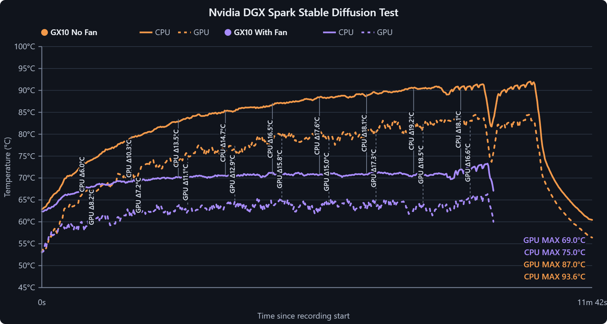
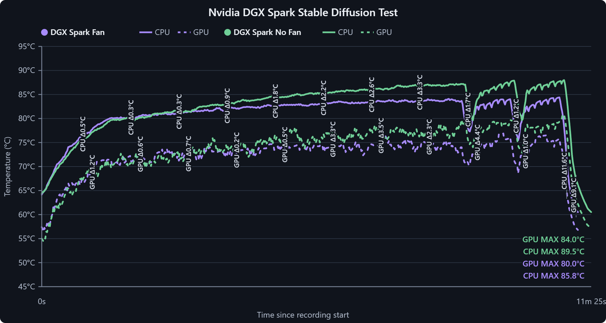

# DGX-Spark-Fan-Shroud

Fan shroud for the NVIDIA DGX Spark (GX10) platform, for improved cooling performance on long workloads. Full STL/STEP files + electronics schematics, plus firmware and host software for automatic temperature-based fan control.

The stock cooling on the DGX Spark can thermal-throttle during sustained multi-hour training or inference runs. This project adds a 3D-printed shroud that mounts a high-static-pressure Noctua industrialPPC fan over the heatsink, driven by a closed-loop controller that ramps fan speed with chip temperature — quiet at idle, full airflow under load.

## Cooling Results

### ASUS Ascent GX10



In this roughly 12-minute run, the shroud reduced the recorded CPU peak from 93.6 °C to 75.0 °C and the GPU peak from 87.0 °C to 69.0 °C — reductions of 18.6 °C and 18.0 °C, respectively.

### NVIDIA DGX Spark



In this roughly 11-minute Stable Diffusion run, the shroud reduced the recorded CPU peak from 89.5 °C to 85.8 °C and the GPU peak from 84.0 °C to 80.0 °C — reductions of 3.7 °C and 4.0 °C, respectively.

### Findings

Both comparisons show lower CPU and GPU peak temperatures with the fan shroud installed. The size of the improvement varies with the system and its vent layout, so the results are reported separately rather than treating a single result as universal.

| System | CPU peak | GPU peak | Observed reduction |
| --- | --- | --- | --- |
| ASUS Ascent GX10 | 93.6 °C without fan vs. 75.0 °C with fan | 87.0 °C without fan vs. 69.0 °C with fan | 18.6 °C CPU, 18.0 °C GPU |
| NVIDIA DGX Spark | 89.5 °C without fan vs. 85.8 °C with fan | 84.0 °C without fan vs. 80.0 °C with fan | 3.7 °C CPU, 4.0 °C GPU |

- **Up to ~18–19 °C lower peak temperatures** in the ASUS Ascent GX10 comparison.
- Configured to **maintain ~80 °C under normal regular use** via the software fan curve.
- See `Benchmark/` for the interactive thermal benchmark graph and source comparisons.

## Compatibility

> **Compatibility note:** This design has been tested on the **ASUS Ascent GX10** and also works on the **NVIDIA DGX Spark**. The cooling improvement is much smaller on the NVIDIA DGX Spark because of its vent layout.
>
> The ASUS Ascent GX10 provides the optimal airflow path for this shroud: cool air enters through the bottom vents and hot air exhausts out the back. Other vendor variants, including MSI and Gigabyte systems, may have different chassis dimensions or vent layouts and may require changes to the design. Editable STEP files are included for adapting the fit.

## Repository Contents

| Path | Description |
| --- | --- |
| `3D Files/STL/` | Print-ready STL files (`DGX Spark Shroud.stl`, `Shroud Leg.stl`) |
| `3D Files/STEP/` | Editable STEP files (`DGX Spark Shroud.step`, `Shroud Leg.step`) for remixing in your CAD tool of choice |
| `Benchmark/` | Interactive thermal benchmark graph plus PNG comparisons for quick viewing on GitHub |

## Bill of Materials

| Part | Purpose | Link |
| --- | --- | --- |
| Noctua industrialPPC fan | High static pressure / airflow through the shroud | https://amzn.to/4gRzM0Q |
| PWM controller | Generates the 25 kHz PWM signal that drives the fan | https://amzn.to/4pzXktr |
| Digital potentiometer | Sets the control voltage on the PWM controller from the microcontroller | https://amzn.to/4ffs8ft |
| RP2040-Zero | Microcontroller that reads temperature and drives the digital potentiometer | https://amzn.to/3TepWfD |

*(Links are Amazon affiliate links.)*

You will also need:

- Appropriate DC power for the fan (check your fan's rated voltage — industrialPPC variants are commonly 24 V)
- A USB-C cable capable of **data** transfer (for flashing the RP2040-Zero)
- Soldering iron and hookup wire, plus M3/M4 fasteners for the shroud legs

## How It Works

1. **Sense** — the control software polls the SoC temperature on the Spark (via `nvidia-smi` / tegrastats / hwmon).
2. **Decide** — a control loop (hysteresis or PI curve) maps temperature to a target fan duty cycle.
3. **Actuate** — the firmware sets the digital potentiometer wiper, which drives the analog control input of the PWM controller, which in turn sets the fan's duty cycle.

This keeps the fan curve entirely under software control — you can tune it from a config file or CLI without touching hardware.

## Wiring

The X9C103 digital pot replaces the Owltree controller's onboard B10K potentiometer: remove (or ignore) the onboard pot and wire the X9C103's resistor terminals to its pads.

### RP2040-Zero → X9C103 Digital Pot

```
RP2040-Zero              X9C103 Digital Pot
────────────              ──────────────────
VBUS / 5V  ────────────── VCC
GND        ────────────── GND
GP29       ────────────── INC
GP28       ────────────── U/D
GP27       ────────────── CS
```

### RP2040-Zero → Owltree PWM Controller

```
RP2040-Zero              Owltree PWM Controller
────────────              ───────────────────────
VBUS / 5V  ────────────── VCC
GND        ────────────── GND
```

### Owltree B10K Pot Pads → X9C103

```
Owltree B10K Pot Pads     X9C103
─────────────────────     ──────
Outer pad 1  ──────────── VH
Center/wiper pad ──────── VW
Outer pad 2  ──────────── VL
```

### Full power layout

```
USB-C 5V
   │
   ├── RP2040-Zero VBUS / 5V
   ├── X9C103 VCC
   └── Owltree PWM Controller VCC

USB-C GND
   │
   ├── RP2040-Zero GND
   ├── X9C103 GND
   └── Owltree PWM Controller GND
```

### Full control layout

```
RP2040 GP29 ───────── X9C103 INC
RP2040 GP28 ───────── X9C103 U/D
RP2040 GP27 ───────── X9C103 CS

X9C103 VH ─────────── Owltree outer pot pad
X9C103 VW ─────────── Owltree center/wiper pad
X9C103 VL ─────────── Owltree outer pot pad
```

If the fan speed moves in the **opposite direction** from what the firmware expects, swap `VH` and `VL`. Do not swap the center `VW` connection.

### Important warnings

- **Check the Owltree VCC pad before wiring.** Only connect the Owltree `VCC` pad to `VBUS/5V` after confirming it is the controller's 5 V logic supply. Do **not** connect a 12 V fan-output or 12 V input rail to the RP2040.
- **Logic voltage.** The RP2040 GPIO pins output 3.3 V logic. Some X9C103 modules powered from 5 V may require a control-high voltage above 3.3 V — if the module does not respond reliably, use a 3.3-to-5 V logic-level shifter on `GP29 → INC`, `GP28 → U/D`, and `GP27 → CS`. Never feed 5 V into an RP2040 GPIO pin.
- **Isolate the original pot.** Remove or electrically isolate the Owltree's original B10K potentiometer before wiring the X9C103 to its pads.

## Flashing the RP2040-Zero

### Method 1: Flash a compiled UF2 file (easiest)

1. Disconnect the RP2040-Zero from USB.
2. Press and hold the `BOOT` / `BOOTSEL` button on the RP2040-Zero.
3. While holding the button, connect the board to your computer with a USB **data** cable.
4. Release the button once the board appears as a USB drive named `RPI-RP2`.
5. Copy the firmware `.uf2` file (e.g. `owltree_fan_controller.uf2`) onto the `RPI-RP2` drive.
6. The drive disconnects automatically and the board reboots into the firmware.

To re-enter bootloader mode at any time, repeat the hold-`BOOTSEL`-while-connecting procedure.

### Method 2: Flash through the Arduino IDE

**Install RP2040 board support:**

1. Open **File → Preferences** and add this URL under **Additional Boards Manager URLs**:

   ```
   https://github.com/earlephilhower/arduino-pico/releases/download/global/package_rp2040_index.json
   ```

2. Open **Tools → Board → Boards Manager**, search for `Raspberry Pi Pico/RP2040`, and install the package by Earle F. Philhower.

**Select the board:**

```
Tools → Board → Raspberry Pi RP2040 Boards → Waveshare RP2040 Zero
```

If that exact entry is unavailable, select `Generic RP2040`.

**Upload:**

1. Connect the RP2040-Zero over USB and select its port under **Tools → Port**.
2. Open the fan-controller firmware sketch and click **Upload**.
3. For the first upload you may need to enter bootloader mode manually: disconnect USB, hold `BOOTSEL`, reconnect USB, release `BOOTSEL`, then click **Upload** again.

After the first successful flash, normal uploads should work without holding `BOOTSEL`.

### Basic X9C103 test firmware

This minimal sketch drives the digital pot to one end stop, then back to ~50% — use it to verify wiring before installing the full firmware:

```cpp
#include <Arduino.h>

constexpr uint8_t PIN_INC = 29;
constexpr uint8_t PIN_UD  = 28;
constexpr uint8_t PIN_CS  = 27;

void pulseIncrement() {
  digitalWrite(PIN_INC, LOW);
  delayMicroseconds(5);
  digitalWrite(PIN_INC, HIGH);
  delayMicroseconds(5);
}

void moveSteps(bool increase, int steps) {
  digitalWrite(PIN_CS, LOW);
  digitalWrite(PIN_UD, increase ? HIGH : LOW);
  delayMicroseconds(5);

  for (int i = 0; i < steps; ++i) {
    pulseIncrement();
  }

  digitalWrite(PIN_CS, HIGH);
  delay(10);
}

void setup() {
  pinMode(PIN_INC, OUTPUT);
  pinMode(PIN_UD, OUTPUT);
  pinMode(PIN_CS, OUTPUT);

  digitalWrite(PIN_INC, HIGH);
  digitalWrite(PIN_UD, LOW);
  digitalWrite(PIN_CS, HIGH);

  delay(1000);

  // Move fully toward the low end.
  moveSteps(false, 110);

  // Move approximately halfway up.
  moveSteps(true, 50);
}

void loop() {
  // Fan remains at the position selected during setup.
}
```

The X9C103 has ~100 positions; sending 110 steps guarantees it reaches the end stop without damage.

### First power-on procedure

1. Power the circuit **without** connecting a fan.
2. Confirm the RP2040 receives ~5 V on `VBUS`.
3. Confirm no RP2040 GPIO pin sees more than 3.3 V.
4. Measure the voltages on the Owltree potentiometer terminals and confirm `VH`, `VW`, and `VL` stay within the X9C103's permitted terminal-voltage range.
5. Connect the fan.
6. Flash the test firmware above and confirm the fan settles at roughly half speed.
7. If the speed direction is reversed, swap `VH` and `VL`.

## 3D Printing

- The revised `Shroud Leg` model is **15 mm longer** (41 mm instead of 26 mm). Matching STL and STEP versions are included so the printable and editable models stay in sync.
- Print the shroud in a temperature-resistant filament — **PETG minimum, ASA/ABS or PC blend recommended** near the heatsink exhaust.
- The leg (`Shroud Leg.stl`) supports the shroud against the chassis; print with the flat face on the build plate.
- Suggested settings: 0.2 mm layers, 4 walls, 40 %+ infill for the legs.

## Firmware & Software

Firmware for the MCU (digital-pot driver, serial command interface) and the host-side daemon (temperature polling + fan curve) live in this repository and are being fleshed out alongside the hardware. See the repo issues/roadmap for current status.

## License

MIT — see [LICENSE](LICENSE).
